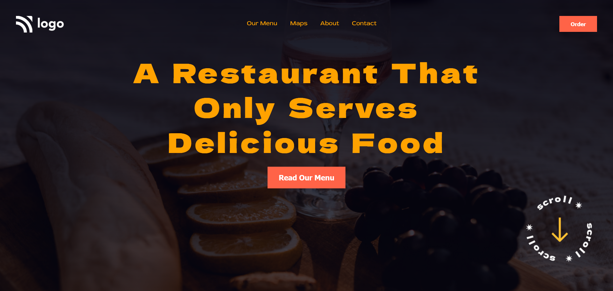

# Food Restaurants Home Page

## Table of contents

  - [Overview](#overview)
    - [The challenge](#the-challenge)
    - [Screenshot](#screenshot)
  - [My process](#my-process)
    - [Built with](#built-with)
    - [What I learned](#what-i-learned)
    - [Continued development](#continued-development)
    - [Useful resources](#useful-resources)
  - [Author](#author)


## Overview

### The challenge

- Use the background image with linear gradient effect.

### Screenshot




## My process

### Built with

- Semantic HTML5 markup
- CSS custom properties like linear-gradient etc.
- Flexbox

### What I learned

- Learn how to use Linear gradient .
  
```css
body {
    background-image: linear-gradient(0deg,rgba(1, 1, 15, 0.7),
    rgba(1, 1, 15, 0.9)),
    url('./assets/pexels-maxyne-barcel-10402282\ 1.png');
    background-size: cover;
    background-repeat: no-repeat;
    background-position: center center;

}

```


### Continued development

- With the css bakground-image properties and effect we can apply on it.

### Useful resources

- [Stackoverflow](https://stackoverflow.com/) - This is a free platform where you find the solution of your problem or an idea related to your problem.


## Author

- Kapil Kharera
- Linkedin - [@kapil-kharera](https://www.linkedin.com/in/kapil-kharera-191b83245/)

